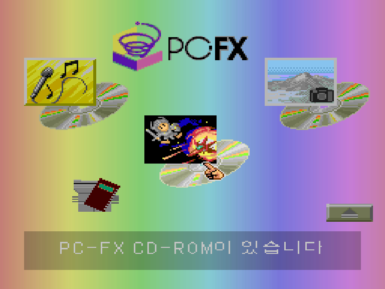
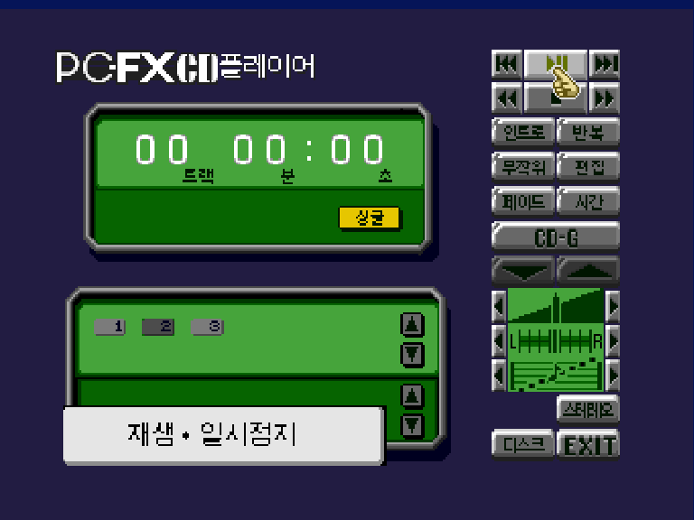
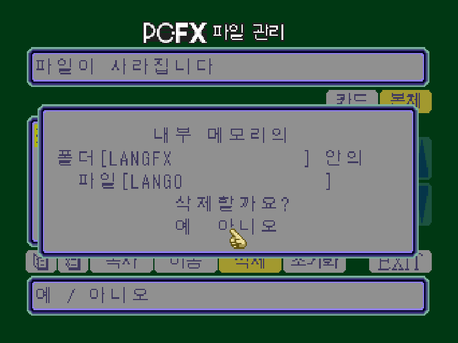
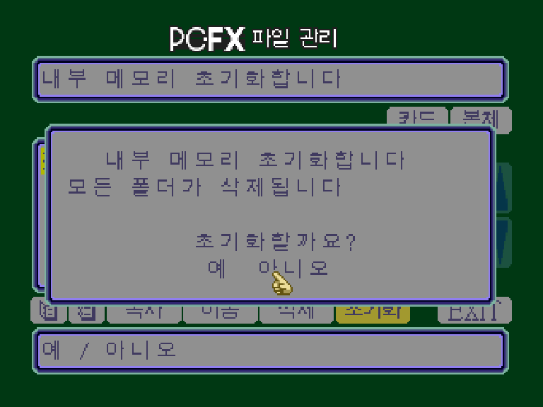
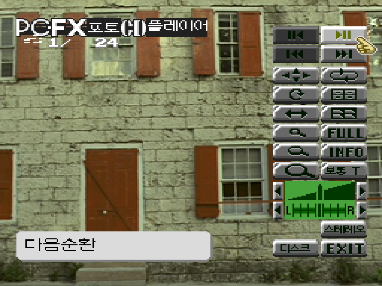
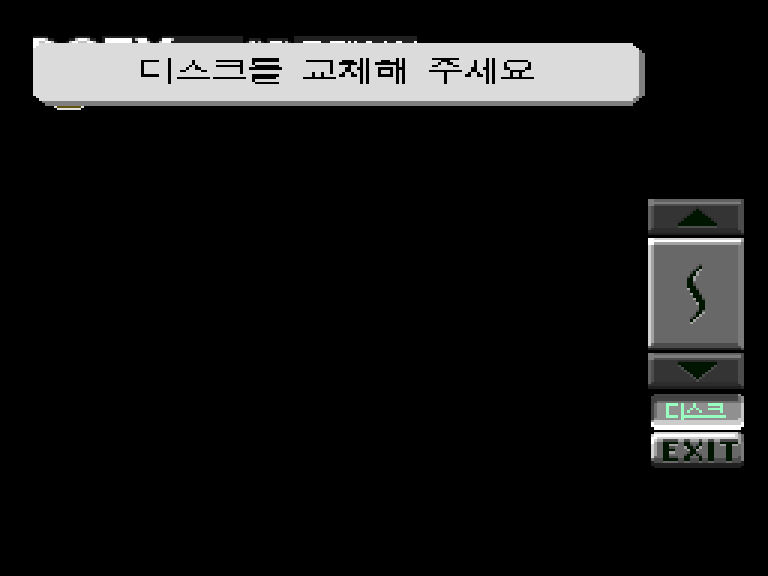

# PC-FX BIOS 한글 패치


**PC-FX BIOS 비공식 한글 패치 1.0 정식판입니다.**

PC-FX BIOS의 일본어 메뉴와 안내를 한글로 옮긴 비공식 한국어 패치입니다.
메인 메뉴, CD/CD-G 재생기, 파일 관리, 포토 CD 재생기를 대상으로 하며,
**PCFX·CD 로고와 영문·숫자 표기는 유지**합니다.

[**1.0 정식판 다운로드**](https://github.com/OldManCraveGuitars-bit/PCFX-Bios-Kr/releases/tag/V1.0) ·
[패치 적용 방법](patch/INSTALL.txt) ·
[수정 내역](CHANGELOG.md) ·
[**버그·번역 오류 제보**](https://github.com/OldManCraveGuitars-bit/PCFX-Bios-Kr/issues)

## 게임에서 쓰는 일본어 글꼴은 그대로 보존했습니다

> **BIOS의 원본 일본어 글꼴을 지우거나 한글로 덮어쓰지 않았습니다.**
> 게임이 BIOS에서 가져다 쓰는 일본어 글꼴은 그대로 사용할 수 있습니다.
> **원본 일본어·영문 글꼴 6종, 총 370,560바이트가 원본과 완전히 동일함을 확인했습니다.**

한글은 별도의 글꼴 데이터와 BIOS 화면용 처리로 추가했습니다.
따라서 **일본어 글꼴 교체 때문에 게임의 일본어 표시가 깨지는 문제를 방지**하며,
게임이 원래 사용하던 글꼴을 보존합니다. ROM 크기도 원본과 같은 **1MB**입니다.

원본 랑그릿사 FX 디스크의 부팅과 오프닝 진입을 확인했습니다.
글꼴 데이터 보존과 모든 게임·실기기의 완전한 호환성 검증은 구분하며,
실행 확인 범위는 [검증 안내](docs/VERIFICATION.md)에 정리했습니다.

## 한글화 범위

- **메인 메뉴** — 메뉴 설명, 디스크 종류와 로딩 안내.
- **CD/CD-G 재생기** — 일본어 버튼, 시간 표시 항목, 조작 도움말, 스테레오·모노 및 L-모노·R-모노 표시.
- **파일 관리** — 카드·본체, 복사·이동·삭제·초기화, 확인창과 오류 안내. `예 / 아니오` 위치도 가운데로 정리했습니다.
- **포토 CD 재생기** — 일본어 버튼과 커서 도움말, 한글 제목, 잘못된 디스크 및 대기 후 디스크 교체 안내.
- **화면 정리** — 버튼에 남은 일본어 도트, 도움말의 흰 배경, 화면 전환 뒤 남는 그래픽 문제 수정.

안내문은 12×12 한글, 포토 CD의 작은 버튼은 8×8 갈무리 셀을 사용합니다.
메인 화면의 큰 글자는 별도 크기로 표시하며, 반각 공백과 기존 버튼 틀에 맞춰 배치했습니다.

## 스크린샷

최종 1.0 배포 내용으로 실행한 에뮬레이터 화면입니다. 보기 쉽게 4:3으로 표시했으며,
화면 안의 글자나 그래픽은 합성하지 않았습니다.

| 메인 메뉴 | CD 재생기 |
| --- | --- |
|  |  |

| 파일 삭제 확인 | 메모리 초기화 확인 |
| --- | --- |
|  |  |

| 포토 CD 재생기 | 포토 CD가 아닌 디스크로 진입 후 대기 |
| --- | --- |
|  |  |

[스크린샷 촬영·표시 안내](screenshots/README.md)

## 패치 적용 방법

1. [1.0 Release](https://github.com/OldManCraveGuitars-bit/PCFX-Bios-Kr/releases/tag/V1.0)에서 **PCFX-Bios-Kr-v1.0.zip** 또는 **PCFX-Bios-Kr-v1.0.ips**를 받습니다.
2. 아래 확인값과 일치하는 **원본 `pcfx.rom`**을 준비합니다.
3. IPS 패처로 `PCFX-Bios-Kr-v1.0.ips`를 원본 BIOS에 적용하여 새 파일로 저장합니다.
4. 사용하는 에뮬레이터에 새 BIOS를 지정하고, 에뮬레이터를 완전히 종료한 뒤 다시 실행합니다.

이전 한글 패치 BIOS에 중복 적용하지 마세요. 에뮬레이터가 `pcfx.rom`이라는 이름을
요구한다면 원본을 따로 보관하고, 적용 결과의 이름을 맞춰 BIOS 폴더에 넣으세요.
기존 상태 저장에는 이전 BIOS의 화면·문자 데이터가 남아 있으므로 새로 부팅해 주세요.

Python 3를 사용할 수 있다면 ZIP에 포함된 확인용 패처도 쓸 수 있습니다.

```text
python patch/apply_patch.py 원본/pcfx.rom 결과/pcfx_kr.rom
```

이 도구는 원본과 결과의 SHA-256을 확인하고, 기존 파일을 덮어쓰지 않습니다.
상세 절차는 [설치 안내](patch/INSTALL.txt)에 있습니다.

### 원본·적용 결과 확인값

| 구분 | 크기 | CRC32 |
| --- | ---: | --- |
| 지원 원본 BIOS | 1,048,576 bytes | `76FFB97A` |
| 1.0 패치 적용 결과 | 1,048,576 bytes | `9E1BE838` |

```text
원본 SHA-256
4b44ccf5d84cc83daa2e6a2bee00fdafa14eb58bdf5859e96d8861a891675417

1.0 적용 결과 SHA-256
b6f584497f3aeb19ef2751eb4aeb1b6661f67742be9f62265f0f333759ec4c5f
```

한글화로 내용이 바뀌므로 ROM 전체 체크섬은 달라집니다. 원본 글꼴 데이터와 ROM 크기는 보존됩니다.
**이 저장소와 릴리스에는 패치 파일만 제공하며, 원본 BIOS와 패치된 BIOS ROM은 포함하지 않습니다.**

## 버그·번역 오류 제보

누락된 일본어, 글자 깨짐, 화면 전환 문제나 멈춤이 있으면
[GitHub Issues](https://github.com/OldManCraveGuitars-bit/PCFX-Bios-Kr/issues/new/choose)에 제보해 주세요.

- 사용한 패치 버전과 에뮬레이터·기기
- 삽입한 디스크와 진입한 메뉴
- 문제가 발생하기까지의 조작 순서와 대기 시간
- 실제 화면의 스크린샷

원본 BIOS·게임 이미지·개인정보는 첨부하지 마세요.

## 제작 및 권리 안내

**기타 깎는 노인 (GiKakNo)** — 한글화·패치 제작·검증.

본 프로젝트가 작성한 코드·문서에는 [MIT 라이선스](LICENSE)를 적용합니다.
원본 BIOS·게임·그래픽·상표와 제3자 글꼴에는 각 권리자의 권리가 적용됩니다.
[라이선스 범위](LICENSE_SCOPE.md) · [글꼴 크레딧](docs/THIRD_PARTY.md)

---

## English

**PC-FX BIOS Korean Patch 1.0 — stable release.**

Korean localization of the PC-FX BIOS menus, CD/CD-G player, file manager and
Photo CD player. Original English labels, numbers, and PCFX/CD logo artwork are retained.

**The original Japanese fonts are preserved.** All six original font regions
(370,560 bytes, including Japanese and Latin fonts) are byte-for-byte identical
to the supported original BIOS. Korean text is added separately, so games can
continue to use the original BIOS font data. The ROM remains exactly 1 MiB.

Original Langrisser FX boot/opening and selected BIOS UI paths have been checked
in emulation. This is not certification of every game or physical console.
See [verification](docs/VERIFICATION.md). Only a patch is distributed; supply your own
supported original BIOS and cold-boot after applying it.
